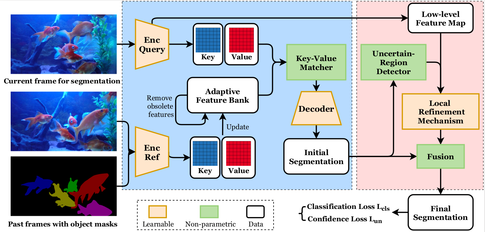

# Video Object Segmentation with Adaptive Feature Bank and Uncertain-Region Refinement

This repository is the official implementation of Video Object Segmentation with Adaptive Feature Bank and Uncertain-Region Refinement (NeurIPS 2020).
It is designed for semi-supervised video object segmentation (VOS) task. 

[\[paper\]](http://arxiv.org/abs/2010.07958)



**Paper corrections:** Our feature map generated by the encoders has 1024 channels and **1/16** of the original image size.


## 1. Requirements

We built and tested the repository on Python 3.6.9 and Ubuntu 18.04 with one NVIDIA 1080Ti card (11GB Memory).
Run on Windows or Mac is possible with minor modifications. 
An NVIDIA GPU card and CUDA environment are required.
To install requirements, run:
```bash
pip3 install -r requirements.txt
```

Install the package [torch_scatter](https://github.com/rusty1s/pytorch_scatter) by the official instructions. Our version is 2.0.4.

## 2. Evaluation

### DAVIS17-TrainVal
1. Download and extract [DAVIS17-TrainVal](https://data.vision.ee.ethz.ch/csergi/share/davis/DAVIS-2017-trainval-480p.zip) dataset.
2. Download the pretrained DAVIS17 [checkpoint](http://www.ece.lsu.edu/xinli/Codes/NeurIPS20_level1_DAVIS17.pth).
3. run:
```bash
python3 eval.py --level 1 --resume /path/to/checkpoint.pth/ --dataset /path/to/dir/
```
To reproduce the segmentation scores, you can use the official evaluation [tool](https://davischallenge.org/davis2017/code.html) from DAVIS benchmark.

### YouTube-VOS18
1. Download and extract [YouTube-VOS18](https://competitions.codalab.org/competitions/19544#participate-get_data) dataset.
2. Download the pretrained YouTube-VOS18 [checkpoint](http://www.ece.lsu.edu/xinli/Codes/NeurIPS20_level2_YouTubeVOS.pth).
3. run:
```bash
python3 eval.py --level 2 --resume /path/to/checkpoint.pth/ --dataset /path/to/dir/ --update-rate 0.05
```
**Attention**: Directly submit our results to the YouTube-VOS codalab for evaluation will pollute the leader board.
We encourage you to submit your own results.

### Long Videos
1. Download and extract [Long Videos](https://www.kaggle.com/gvclsu/long-videos) dataset.
2. Download the pretrained YouTube-VOS18 checkpoint above.
3. run:
```bash
python3 eval.py --level 3 --resume /path/to/checkpoint.pth/ --dataset /path/to/dir/ --update-rate 0.05
```
To reproduce the segmentation scores, you can use the same tool from the DAVIS benchmark.

### Your Own Video

Prepare your video frames and the first frame annotation following the data structure of the long videos page.
You can see the data structure without download it and you only need to provide the first frame annotation.

Run the same parameters as the long videos setting.

### Options for Evaluation
1. `--gpu`: GPU id to run (default: 0).
2. `--viz`: Enable output overlays along with the estimated masks (default: False).
3. `--budget`: The number of features that can be stored in total (default: 300000 for 1080Ti).

By default, the segmentation results will be saved in `./output`.

## 3. Training

### Pre-training on Static Images

1. Download the following the datasets (COCO is the largest one). You don't have to download all, our pretrain codes skip datasets that don't exist by default.
2. Run `unify_pretrain_dataset.py` to convert them into a uniform format (followed DAVIS).
```bash
python3 unify_pretrain_dataset.py --name NAME --src /path/to/dataset/dir/ --dst /path/to/output
```
1. [MSRA10K](https://mmcheng.net/msra10k/):  `--name MSRA10K`
2. [ECSSD](http://www.cse.cuhk.edu.hk/leojia/projects/hsaliency/dataset.html): `--name ECSSD`
3. [PASCAL-S](http://cbs.ic.gatech.edu/salobj/download/salObj.zip): `--name PASCAl-s`
4. [PASCAL VOC2012](http://host.robots.ox.ac.uk/pascal/VOC/voc2012/): `--name PASCALVOC2012`
5. [COCO](http://cocodataset.org/#download): `--name COCO`.
    API [pycocotools](https://github.com/cocodataset/cocoapi/tree/master/PythonAPI) is required. 

You may need minor modifications in the dataset path. Descriptions of useful options,
1. `--palette`: Path to the palette image. We provide a template in `assets/mask_palette.png`, followed the formats of DAVIS17.
2. `--workder`: The parallel threads number to accelerate the procedures (Default: 20).

After the conversion process, you can start pre-training the model:
```bash
python3 train.py --level 0 --dataset /path/to/pretrain/ --lr 1e-5 --scheduler-step 3 --total-epoch 12 --log
```  
Pre-training process may takes days to weeks, you can download our [checkpoint](http://www.ece.lsu.edu/xinli/Codes/NeurIPS20_level0_PreTrain.pth) to save time.

### Training on DAVIS17

Download the semi-supervised TrainVal 480p from the [DAVIS](https://davischallenge.org/davis2017/code.html) website.
Run 
```bash
python3 train.py --level 1 --new --resume /path/to/PreTrain/checkpoint.pth --dataset /path/to/DAVIS17/ --lr 4e-6 --scheduler-step 200 --total-epoch 1000 --log
``` 

### Training on YouTube-VOS
Download training set of the [YouTube-VOS](https://competitions.codalab.org/competitions/19544#participate-get_data) dataset.
Run
```bash
python3 train.py --level 2 --new --resume /path/to/PreTrain/checkpoint.pth --dataset /path/to/YouTubeVOS/train --lr 4e-6 --scheduler-step 30 --total-epoch 150 --log
```

## 4. License

This repository is released for academic use only. If you want to use our codes for commercial products, please contact xinli@cct.lsu.edu in advance.
If you use our codes, please cite our paper,
```bibtex
@inproceedings{liang2020video,
  title={Video Object Segmentation with Adaptive Feature Bank and Uncertain-Region Refinement},
  author={Liang, Yongqing and Li, Xin and Jafari, Navid and Chen, Qin},
  booktitle={Advances in neural information processing systems (NeurIPS)},
  year={2020}
}
```
